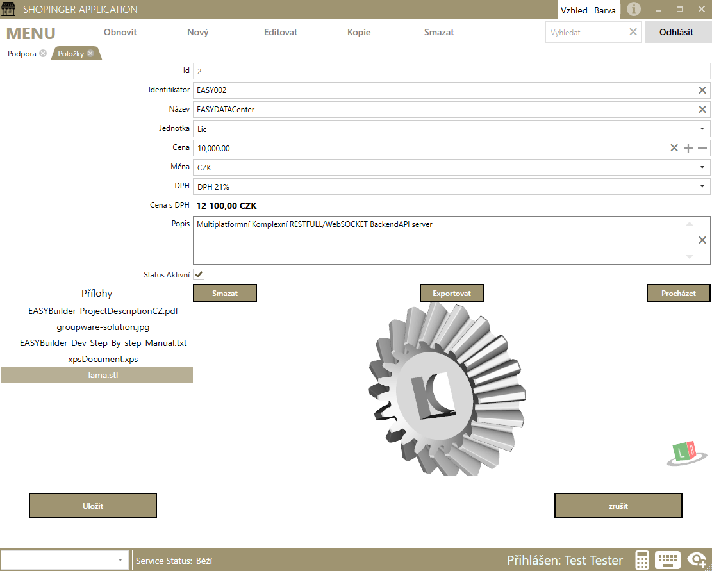
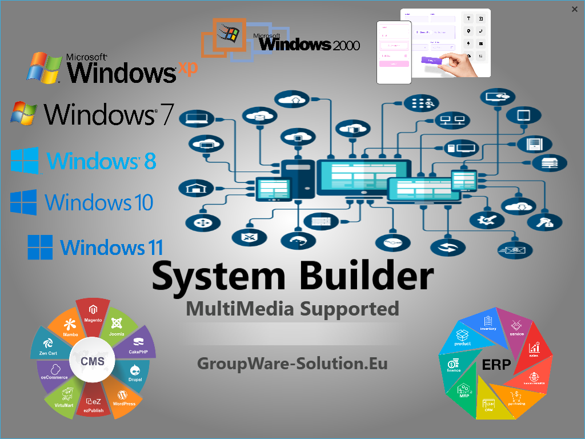

#### UNIVERSAL MODERN BE + MS FE SOLUTION FOR BUILDING ANY 3-layer technological software or its parts
<sup>**For thinking, the development of tools and work with them worthy in the 21st century**</sup>


* EASYDATACenter - Universal multi-platform MultiDatabase Backend server solution with all standard technologies implemented
* EASYSYSTEMBuilder - Universal modern Metro WPF Frontend System Builder solution for quick and easy development of any system with minimal knowledge
* Combined solution - is a simple solution for rapid development of any modern system,
    runs perfectly on prepared System Core and templates for Graphical/Click Development


---

**Complete Development Documentation and Smart Search:   [https://liborsvoboda.github.io/EASYSYSTEM-EASYSERVER-EN](https://liborsvoboda.github.io/EASYSYSTEM-EASYSERVER-EN "")**   

---

#### ScreenShoty



        

---

#### GLOBAL CORE POLICY - QUICK START BUILDING YOUR OWN SYSTEM

[Quick Start of Custom System Development - Manual EN](https://github.com/liborsvoboda/EASYSYSTEM-EASYSERVER-EN/tree/main/CustomSystemCreationIdeaCz.MD "Logic of Global Systems")  

---
## What you need to know for proper development
[Basic information to start development](https://github.com/liborsvoboda/EASYSYSTEM-EASYSERVER-EN/tree/main/EASYSYSTEMBuilderProject-WPFNET4.5+/EASYBuilderProjectCoreDescription/AutoJoinModelConditions.md "")  
[Standardized Page/Agenda structure](https://github.com/liborsvoboda/EASYSYSTEM-EASYSERVER-EN/tree/main/EASYSYSTEMBuilderProject-WPFNET4.5+/EASYBuilderProjectCoreDescription/Page-AgendaStructure.md "")  
[System templates](https://github.com/liborsvoboda/EASYSYSTEM-EASYSERVER-EN/tree/main/EASYSYSTEMBuilderProject-WPFNET4.5+/EASYBuilderProjectCoreDescription/SystemTemplates.md "")  
[Print Reports](https://github.com/liborsvoboda/EASYSYSTEM-EASYSERVER-EN/tree/main/FYIReporting%26Help%26Tips/README.MD "")  

----

## Complete System Core Information - A global view of everything is the building block of the core
[Definition of the basic system structure](https://github.com/liborsvoboda/EASYSYSTEM-EASYSERVER-EN/tree/main/EASYSYSTEMBuilderProject-WPFNET4.5+/EASYBuilderProjectCoreDescription/CoreStructureDefinition.md "")  
[MainWindow Central System Control](https://github.com/liborsvoboda/EASYSYSTEM-EASYSERVER-EN/tree/main/EASYSYSTEMBuilderProject-WPFNET4.5+/EASYBuilderProjectCoreDescription/MainWindow-CentralCorePoint.md "")   
[Implemented tools in the core](https://github.com/liborsvoboda/EASYSYSTEM-EASYSERVER-EN/tree/main/EASYTOOLS/README.MD "")   
[Information about printing solution](https://github.com/liborsvoboda/EASYSYSTEM-EASYSERVER-EN/tree/main/EASYSYSTEMBuilderProject-WPFNET4.5+/EASYBuilderProjectCoreDescription/Printing&SystemJoins.md "")  


---

## EASY-SYSTEM-Builder
Visual Studio project solution EASYSYSTEMBuilder for

**C# WPF Low/no code solution For immediate development of your own SYSTEM:**
* FOR EVERY Company/Data Management/IS/OS/HW
* Multilingual WPF application supported
* Full support for the creation of any MS system (modern SAP, etc.).
* Control system with graph support
* Support for a unique media system,
* Touch terminals supported
* Bussiness/City/Country/ANY touch touch terminals on Windows AIO monitors are supported
* NEXT YEAR Web Convert Support for LINUX/WINDOWS
* Thousands of IS/OS/etc. tools on Github for free
* Transparent clean code
* Low/no code development support - Click-to-click graphic development

**For standard IT/terminal systems development, the XAML graphical Builder with Class Copy is all you need for development**
* System updates are free
* Code updates and all changes are public

```
1. DataWorking/IO/PRINT/SHOW
With all types of data form templates for standardized:
DATAView / DATADetail / DATAView with SubDATAview / DATAView with SubFullDataDetail
3D / Document / Video
1. To build ANY information / multimedia / control / flow / reporting and other systems
```

**COPY/PASTE DEVELOPMENT PRICE 5000CZK/200EURO - PROJECT LICENSE** 

---

## EASY-DATA-CENTER
Visual Studio project solution EASYDATACenter ASPNETCORE6 providing:

Simple development of Universal secure Multiplatform MultiDB Backend Server
With RESTFULL / WEBSOCKET implementations

* With all types of templates for INSERT / UPDATE / DELETE / SELECT / PROCEDURE / SUBFORMDATA / etc.
* WITH DATABASE, table template, Procerure template, view template,
* Backup/restore/set DB rights and other examples
* With tables, indexes, foreign keys in all standard DB uses

      **COPY/PASTE DEVELOPMENT PRICE 5000CZK/200EURO - PROJECT LICENSE**

---

## FYI Reporting - Report Editor / Viewer
FreeWare Full Report Designer and Viewer for printing all types of documents / barcodes, EAN, QR

---
## EASYTOOLS
* Add-ons for touch panels, controls, data types, forms, media, documents, 3D,
* They are completely free to download (including every license pack)  
* Open Source community to include more than 1000 tools in the system by community  

----
 
## EXISTING CLONE SYSTEMS CREATED IN 14 DAYS
1. **LicenseSrv**
MultiOS license server with listening API GET/POST server / generation of unlimited static/dynamic license CODES and application client to manage the Server
1. **GUIDES** Windows XP+ Implementation of production sources in the production of a production company For office / touch panels with an unlimited number of clients and the possibility of printing
1. **ShoPingER** Windows XP+ Multi Branch Quotation/Order/Invoicing system with multimedia files supported by unlimited clients and printing capabilities
1. **LicenceShoper** MultiOS License Server PLUS Windows XP+ MultiBranches Billing System [LicenseSrv + ShoPingER]

---

## SOLUTION - WHERE TO FIND COMPLETE INFORMATION
All documentation, license, case study, price list, media, developer information, help, manuals, technology information, installation, images, videos, downloads, etc. can be found here:


* Info Storage: [https://groupware-solution.eu/webdav/Marketing/](https://groupware-solution.eu/webdav/Marketing/ "webdav Projects Storage")  
   with login name/password: marketing/marketing
* Youtube: [https://www.youtube.com/playlist?list=PLmE7gP9LTBimNJQ444ypG8HVce23fa2Hb](https://www.youtube.com/playlist?list=PLmE7gP9LTBimNJQ444ypG8HVce23fa2Hb)  
* Facebook: [https://www.facebook.com/GroupWareSolution](https://www.facebook.com/GroupWareSolution)  
* LinkedIn: [https://www.linkedin.com/in/libor-svoboda-7b96014a/](https://www.linkedin.com/in/libor-svoboda-7b96014a/)  
* Eshop: [https://GroupWare-Solutions.Eu](https://GroupWare-Solution.Eu)  
* Website: [https://GroupWare-Solution.Eu](https://GroupWare-Solution.Eu)  
* Online Application to try: [Https://KlikneteZde.Cz](Https://KlikneteZde.Cz)  
* GitHub complete Information and help: [https://github.com/liborsvoboda/EASYSYSTEM-EASYSERVER-EN](https://github.com/liborsvoboda/EASYSYSTEM-EASYSERVER-EN)  


**Complete Development Documentation and Smart Search:**   [https://liborsvoboda.github.io/EASYSYSTEM-EASYSERVER-EN](https://liborsvoboda.github.io/EASYSYSTEM-EASYSERVER-EN "")  

---
## Contacts  


**Email:**
- Libor.Svoboda@GroupWare-Solution.eu  
- Libor.Svoboda@KlikneteZde.Cz


**Address:**  
Street: Žlutava 173  
City: Žlutava  
PostCode: 761 63  
State: Czech Republic  
Phone: 00420 724 986 873  

   
